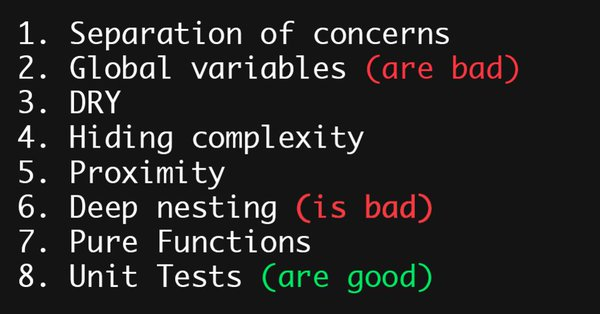

# 0- JELOU

## Un ejemplo que huele mal.

> "Cualquier código tuyo que no hayas mirado en los últimos seis meses, es como si lo hubiese escrito otro"
>
> -- Eagleson's Law

* Cualquier código de más de una semana es heredado.
* El código es como el pescado, en una semana huele mal.
* El código heredado huele mal.
* El código heredado es una oportunidad de mejora.
* Reescribirlo para entenderlo es una necesidad.

[Origen](https://github.com/benbyford/game-of-life-js)

> "The ratio of time spent reading versus writing is well over 10 to 1. We are constantly reading old code as part of the effort to write new code. ...[Therefore,] making it easy to read makes it easier to write."
>
> -- _Robert C. Martin_
