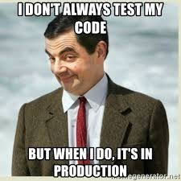

# 1- TEST

## Software que funciona

> "Codifica siempre como si la persona que finalmente mantendrá tu código fuera un psicópata violento que sabe dónde vives."
>
> -- _Martin Golding_

---

### Limpiar requiere cambiar por dentro sin cambiar por fuera

- Necesitamos pruebas para limpiar tranquilos.
- Haz algún tipo de prueba, no demasiadas.
- Mejor pruebas de integración.
- Pero que sean automáticos.
- Los tests SON código.
- Los tests deben estar limpios.

### Si funciona, y tienes pruebas, tócalo

---

> "¿Por qué la mayoría de los desarrolladores temen hacer cambios en su código? Porque ¡Tienen miedo a que se rompa!

> ¿Por qué tienen miedo de romperlo? Porque no tienen pruebas."
>
> -- _Robert C. Martin_

- [Siguiente ->](./2-format.md)

- [<- Vuelta al índice ](./)

- [Repo](https://github.com/AcademiaBinaria/CleanCode)
