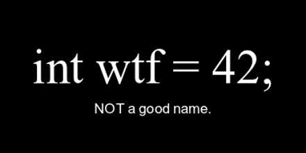

# 3- NAMES

## Dar sentido mediante los nombres

> "Solo hay dos cosas difíciles en Informática: invalidar la caché y nombrar cosas"
>
> -- _Phil Karlton_

---

### Claridad

#### Mostrar la INTENCIÓN

Explicar por qué se hace.

### Reglas

#### Sustantivos para variables / propiedades

- Vocabulario de **entidades y propiedades** de negocio

  - client, customer ?
  - document, file ?

#### Verbos para funciones / métodos

- Vocabulario para **relaciones y acciones** comunes

  - is, has, get, set, can, must, do
  - create, read, update, delete
  - select, insert, update, delete
  - get, post, put, delete

### Consistencia

- Mejor ser **consistente** con pocas normas...
- ... que cambiar de norma consistentemente.

### Piensa en mi

- No me sorprendas
- No me hagas pensar

---

> "Un nombre descriptivo largo es mejor que un nombre corto enigmático.

> Un nombre descriptivo largo es mejor que un comentario descriptivo largo.

> Nombra una variable con el mismo cuidado con el que nombras a un primogénito"
>
> -- _Robert C. Martin_

- [Siguiente ->](./4-blocks.md)

- [<- Vuelta al índice ](./)

- [Repo](https://github.com/AcademiaBinaria/CleanCode)
