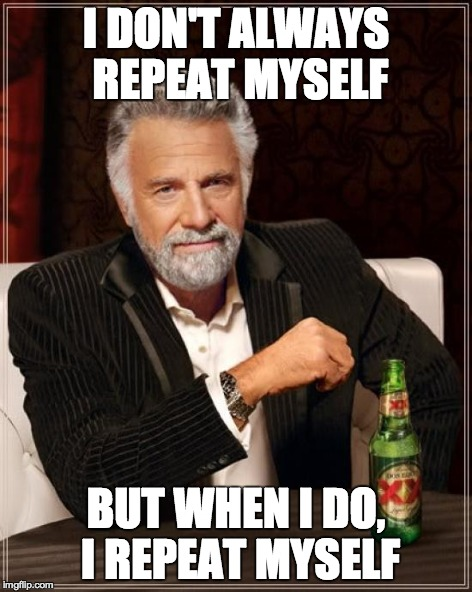

# 5- FUNCTIONS

## Pequeñas piezas para organizar programas

> "Una función debería hacer una sóla cosa, hacerla bien, y hacerla sólo ella".
>
> -- _Ley de Curly_.

---

### Pequeñas y Claras

* Cuanto más pequeñas más reutilizables.
* Con **verbos** en su nombre que indiquen propósito
* DRY: Don´t Repeate yourself.
  * ...sin comentarios.

### Estilos

* Si no usas POO, usa funciones puras:

  * predecibles
  * sin dependencias del entorno
  * sin efectos secundarios en el entorno

* Si usas POO, cuantos menos argumentos mejor.

* Retornando datos, no errores.

  * Si el lenguaje no lo permite, usar convenio.

### Objetivo: Muchas Pequeñas Funciones Organizadas

* Una función, un sólo propósito.

  * ... o al menos un mismo nivel de abstracción.

* Sin comentarios.
  * ¿Me repito?. MAL!!!

---

> "Una función debería hacer una sóla cosa, hacerla bien, y hacerla sólo ella".
>
> -- _Ley de Curly_.

---

> "La duplicidad es el principal enemigo de un sistema bien diseñado"
>
> -- _Robert C. Martin_
