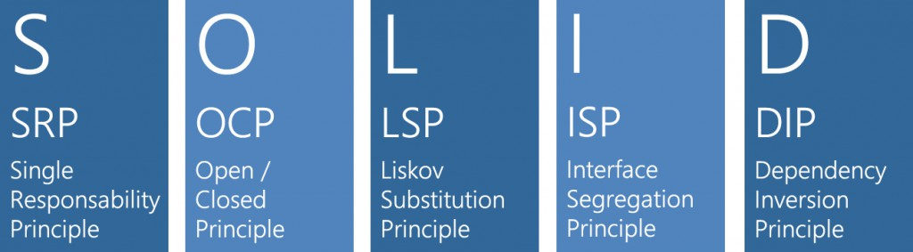

# 7- OBJECT

## Arquitectura limpia

> "La encapsulación es importante; pero la razón por la cual es importante es aún más importante. La encapsulación nos ayuda a razonar sobre nuestro código".
>
> -- _Michael C. Feathers_.

### Las clases, como las funciones, Pequeñas y Claras

* Los objetos encapsulan la lógica.

  * Usan estructuras de datos.

* Suelen representar **Actores**.

  * Relacionan unas entidades con otras.

* **Interfaces** mejor que herencia

---

### S SRP

**Principio de responsabilidad única (Single responsibility principle)**
Un objeto solo debería tener una única responsabilidad, o razón para cambiar.

### O OCP

**Principio de abierto/cerrado (Open/closed principle)**
Las entidades de software deben estar abiertas para su extensión, pero cerradas para su modificación.

### L LSP

**Principio de sustitución de Liskov (Liskov substitution principle)**
los objetos de un programa deberían ser reemplazables por instancias de sus subtipos sin alterar el correcto funcionamiento del programa.

### I ISP

**Principio de segregación de la interfaz (Interface segregation principle)**
Muchas interfaces cliente específicas son mejores que una interfaz de propósito general.​

### D DIP

**Principio de inversión de la dependencia (Dependency inversion principle)**
Depender de abstracciones, no depender de implementaciones; usando la Inyección de Dependencias.

---

> "Los objetos protegen sus datos detrás de abstracciones y exponen las funciones que operan con esos datos."
>
> -- _Robert C. Martin_
