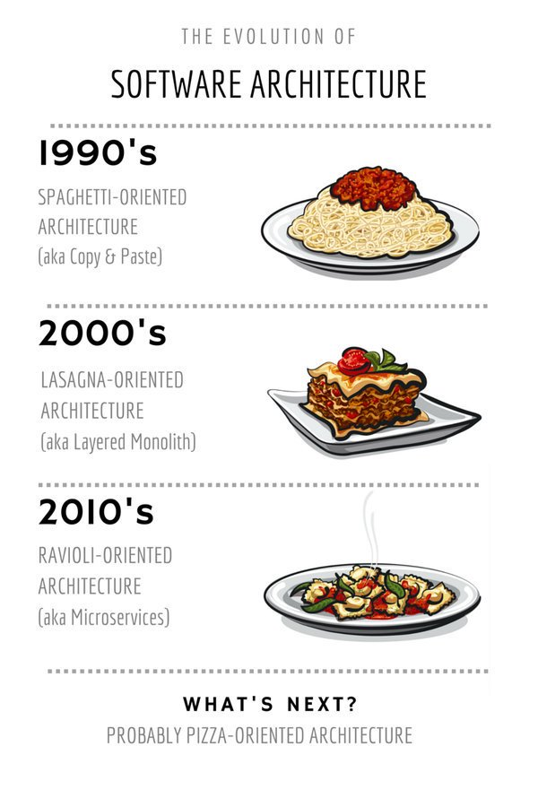

# 8- SYSTEMS

## Responsabilidad repartida

> "Dentro de cada gran programa hay un pequeño programa tratando de salir.".
>
> -- _Tony Hoare_.

---

- Las instrucciones se agrupan en bloques
  - Los bloques forman funciones
    - Las funciones implementan lógica en objetos
      - Los objetos se organizan en sistemas.

### Los sistemas de clases se componen de

- Piezas reemplazables

### Los sistemas de clases se organizan en

- Capas y niveles de abstracción

### Los sistemas de clases tienen

- Sus Dependencias Controladas en todo momento.

---

> "La duplicidad es el principal enemigo de un sistema bien diseñado".

> ;-)
>
> -- _Robert C. Martin_
