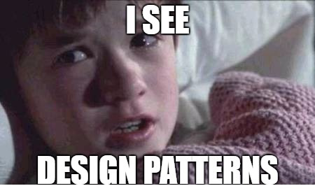

# 9- FACTORIES

## Construcción de sistemas

> "La simplicidad consiste en quitar lo obvio y agregar lo significativo.".
>
> -- _John Maeda_.

---

### Orden y Control

- Espacios de nombres
- Herencia de conocimiento
- Control de fronteras

### Fabricamos sistemas usando objetos y estructuras de datos

- Pensando en el **Mantenimiento**
- Pensando en la **EVOLUCIÓN**
- ...sin caer en el _por si acaso_.

---

> "No es el lenguaje lo que hace que los programas parezcan simples.

> Es el programador el que hace que el lenguaje parezca simple!"
>
> -- _Robert C. Martin_

[Vuelta al índice](./readme.md)
