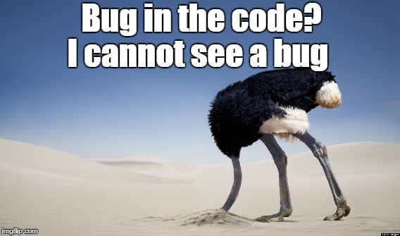

# a- EXTRA

## Errores, excepciones, usuarios y programadores

> "Si la depuración es el proceso de eliminar errores, entonces la programación debe ser el proceso de ponerlos".
>
> -- _E. W. Dijkstra_.

---

### Código excepcionalmente robusto

#### En desarrollo

- Detección temprana de errores con herramientas y tests.
- Diferenciar entre lo improbale, lo excepcional y lo incorrecto.

#### En ejecución

- Recuperar mucha información técnica para el diagnóstico.
- Pero informar al usaurio en el tono adecuado.
- Dar una pista para la siguiente acción.

> "Code smells.".
>
> -- _Martin Fowler_.

- Detectar y eliminar los Malos Olores

---

> "Duplication is the primary enemy of a well-designed system"

> ;-)

> ;-)
>
> -- _Robert C. Martin_

- [Siguiente ->](./b-end.md)

- [<- Vuelta al índice ](./)

- [Repo](https://github.com/AcademiaBinaria/CleanCode){:target="\_blank"}
