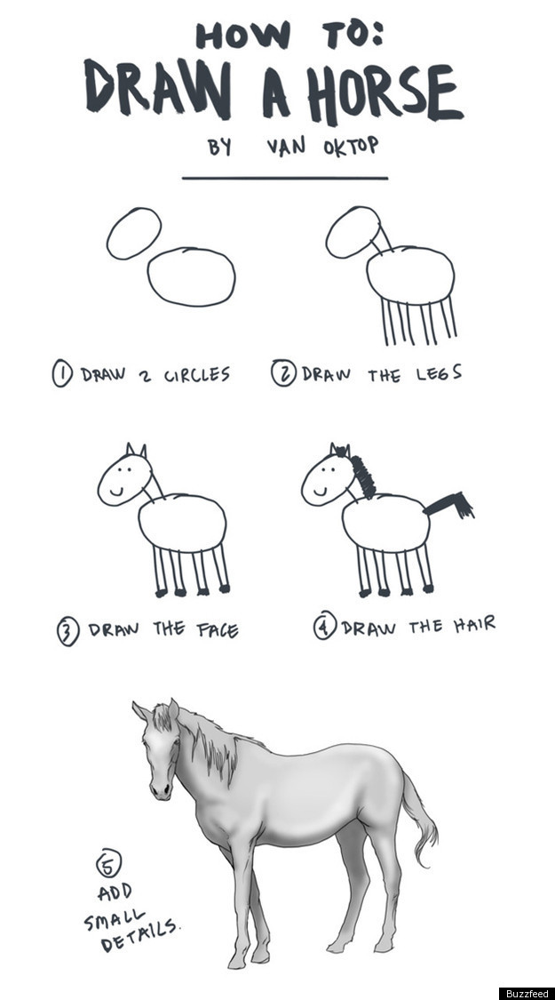

# b - END

> "First do it, then do it right, then do it better".
>
> -- _Addy Osmani_.

> "Good programming is good writing".
>
> -- _John Shore_.

---

## Artesanía del software

### No sólo software que funciona, también software bien diseñado

### No sólo respondo al cambio, también agrego valor

### No sólo individuos e interacciones, también una comunidad de profesionales

### No sólo colaboración con el cliente, también asociaciones productivas

> "Voy a hacer un buen trabajo. No tengo prisa. Escribiré tests. Iré rápido a base de hacerlo bien. No escribiré mierda. Voy a practicar, practicar y practicar porque eso es lo que hace un profesional.
>
> -- _Un Artesano del software_

---

---

---

> "It's a lot easier to talk about code than it is to write code".
>
> -- _John O'Nolan_.

> "El **código limpio** no se escribe siguiendo un conjunto de reglas. No te conviertes en un artesano de software al aprender una lista de heurísticas. El profesionalismo y la artesanía provienen de valores que impulsa la **disciplina**."
>
> -- _Robert C. Martin_
